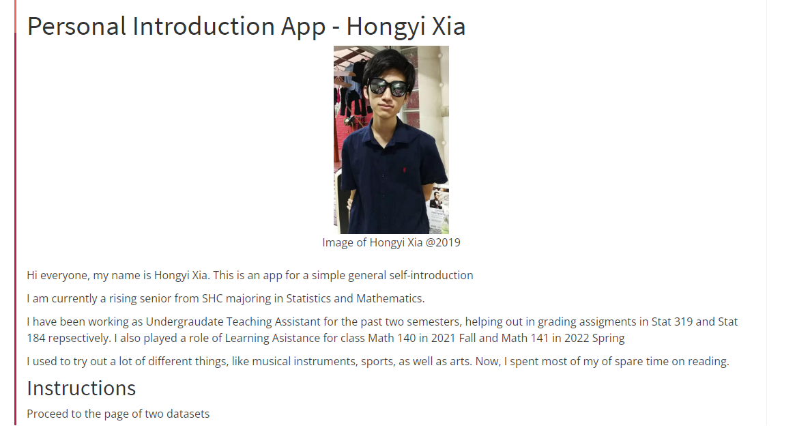

# K-means Clustering ShinyApp

A learning application that demonstrates the progressively changing iterations and the ultimate points of convergence of the K-means algorithm

## Notice
This repository was created by Hongyi Xia to present on the finalized ShinyApp for the sake of clarity and conciseness. Any intermediate working proceduce carried out by Hongyi Xia and his professors can be found at a different repository @ https://github.com/EducationShinyAppTeam/k_means_clustering/tree/dev_summer_2022

## Important files to highlight
app.R : The R file that containts the R code to establish the ui and server for the ShinyApp \
\
Kiterfunction.rds : The RDS file that imports the object where the coordinates of the iris data points and centroids for each K-means iteration are stored

## An Example page to demonstrate a typical progression of K-means on iris dataset

## An Explore page to set your own inital centroids and have the k-means cluters as the output

