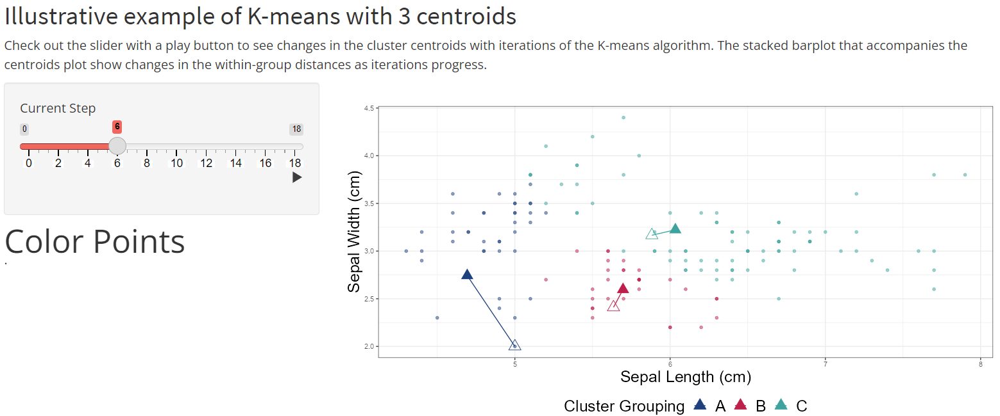
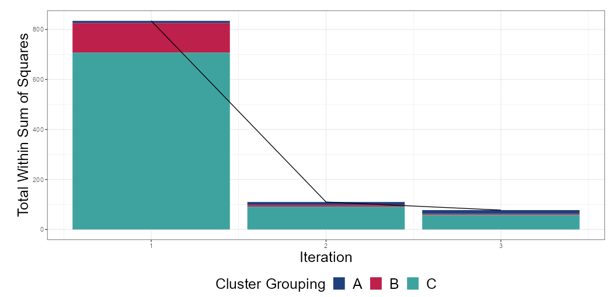
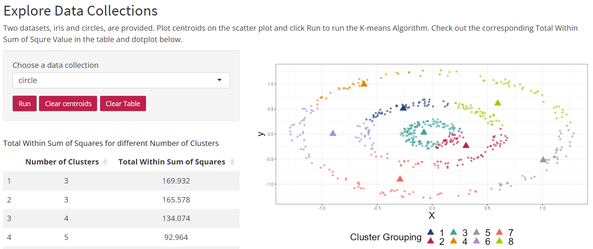
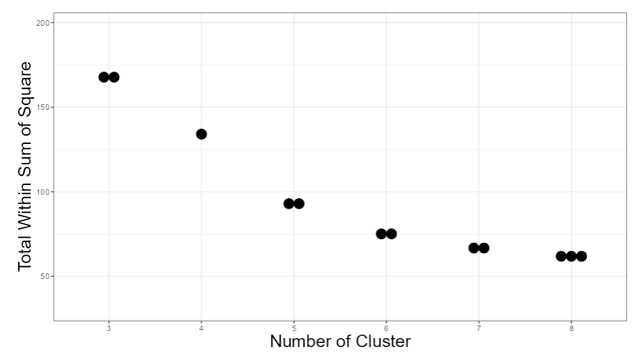

# K-means Clustering ShinyApp

A learning application that demonstrates the progressively changing iterations and the ultimate points of convergence of the K-means algorithm

## Notice
This repository was created by Hongyi Xia to present on the finalized ShinyApp for the sake of clarity and conciseness. Any intermediate working proceduce carried out by Hongyi Xia and his professors can be found at a different repository @ https://github.com/EducationShinyAppTeam/k_means_clustering/tree/dev_summer_2022

## Key files to highlight
- app.R : The R file that containts the R code to establish the ui and server for the ShinyApp 

- Kiterfunction.rds : The RDS file that imports the object where the coordinates of the iris data points and centroids for each K-means iteration are stored

## An Example page to demonstrate a typical progression of K-means on iris dataset
- In the illustration below, the iris data points are graphed with Sepal Width against Sepal Length. K-means with 3 cluster is applied on the iris data points

- One can interact with the slider and the play button on the right to carry out K-means algorithm. From step 0 to step 18, the process of changing the classificaiton of data points and the process of moving the centroids alternate to progress through k-means algorithm

- In the stacked barplot of total within sum of squares versus iteration below, different color bars of respective height represent the total within sum of squares for that colored cluster. Hence, the stacked bars give the sum of the total within sum of squares for all the clusters. Whenever there is a change in the position of centroids and a corresponding change in the classificaiton of data points, the total within sum of squares decreases as k-means algorithm progress

## An Explore page to customize your own k-means
- In the illustration below, aftering selecting a dataset to work with from the bulletin board, click on the diagram that displays the data points on the right to set initial centroids

- After choosing the desired number and the inital position of centriods, click the 'Run' button to display the classification end result of k-means

- 'Clear centroids' button erase the plotted centroids in the diagram no matter it is before or after the execution of k-means algorithm

- Any previous attempts to run k-means will store their relevant infomation in a table. Those information include 'Number of Clusters' and 'Total Within Sum of Squares' and will be used to create the dotplot of 'Total Within Sum of Square' versus 'Number of Cluster' shown in the figures below.

- Note ! Not all kinds of dataset can be reliably grouped in clusters by k-means. Just like the circlue dataset shown in the figure below, the optimum reliable way to cluster is to break down the data points by the outer circular layer, the middle circular layer, and the inner circular layer. This can be accomplished by spectrum clustering rather than k-means
 

- Using the dotplot of 'Total Within Sum of Square' versus 'Number of Cluster' shown below, an elbow in the dotplot can be identified as long as there are sufficient number of k-means tests for each number of clusters. The elbow will help to estimate the optimum number of clusters desired for that dataset.

